# StardewValley（Cocos2d-x / C++）

本项目是一个基于 **Cocos2d-x 3.17.2** 的 2D 模拟经营/冒险类小游戏项目（类《星露谷物语》玩法），核心代码位于 `Classes/`，资源位于 `Resources/`，当前主要面向 **Windows（Win32）** 构建与运行。

## 运行与构建（Windows）

### 环境要求

- Visual Studio 2022（安装 “使用 C++ 的桌面开发”）
- 工具集 `v143`（项目文件已指定）

### 运行步骤

1. 用 VS 打开 `proj.win32/StardewValley.sln`
2. 选择配置 `Debug | Win32` 或 `Release | Win32`
3. 生成并运行 `StardewValley`

构建时会将 `Resources/` 复制到输出目录（见 `proj.win32/StardewValley.vcxproj` 的自定义步骤），运行时需保证可执行文件同目录下存在 `Resources/`。

## 加分项

### （1）版本控制与协作

- 迭代节奏：以“小步提交 + 可回滚”为原则推进功能与修复，降低回归定位成本。
- 协作方式：按 UI、地图、玩法系统、数据/存档与文档等模块拆分任务，减少冲突；集成阶段通过合并提交集中收敛变更。
- 可追溯性：Commit 记录清晰，提交信息覆盖玩法迭代与问题修复（例如钓鱼节与天气冲突、鱼速度异常等），便于按问题回溯定位相关改动。
- 合理的分工：

| 姓名       | 学号      | 分工比例 | 分工                                                                                                                                                                                                                                                                                                                                                                                                                                                                                                                                                                                                                                                                                                                                                                                                                                                                                                                                                                                  |
|:--------:|:-------:| ---- |:-----------------------------------------------------------------------------------------------------------------------------------------------------------------------------------------------------------------------------------------------------------------------------------------------------------------------------------------------------------------------------------------------------------------------------------------------------------------------------------------------------------------------------------------------------------------------------------------------------------------------------------------------------------------------------------------------------------------------------------------------------------------------------------------------------------------------------------------------------------------------------------------------------------------------------------------------------------------------------------:|
| 薛飞扬 (组长) | 2351510 | 25%  | **各场景类、各地图类（包括瓦片地图的绘制）、各地图控制器类（除矿洞）、环境障碍物系统、各Interactor类与TileSelector类、天气系统、时间/昼夜系统、季节系统、捏脸系统、掉落物系统、部分UI系统的初步构建**  `SceneBase`基类及各派生类：游戏内各个场景的管理与逐帧更新  `Game`下的 `MapBase`基类及各派生类：.tmx地图的读取  `Controller`下的 `IMapController`基类及各派生类：地图控制器，用于控制地图状态与交互  `Game/EnvironmentObstacle`下的 `EnvironmentObstacleBase`基类及各派生类：实现单个环境障碍物的定义，例如单棵树、单个石头等  `Controller/Environment`下的 `EnvironmentObstacleSystemBase`基类及各派生类：组合单个环境障碍物，实现环境障碍物系统，作为地图中环境障碍物的唯一来源  `Controller/Interact`下的各 `Interactor`类：用于实现地图中的交互功能  `TileSelector`：用于实现对人物前方9*9格子的选取  `Controller/Weather`下的 `WeatherController`类：实现天气系统（晴/雨）；`RainLayer`类：用于实现雨水的粒子效果  `GameStateController` 类：用于实现时间的推进  `WorldState`结构体：用于全局记录游戏数据  `Classes/Scenes/CustomizationScene`类与 `Classes/Game/View/PlayerView`类：用于实现捏脸功能，前者为捏脸选择界面，后者为捏脸完成后的人物外观表现                                                                                                                          |
| 冯泉睿      | 2353365 | 25%  | **矿洞地图与场景、采矿与战斗系统、可放置物系统、物品栏与背包、工具与工具升级系统、存档系统及相关部分UI**  `MineScene` / `MineMapController/MineMap`：在SceneBase基础上实现矿洞场景与多楼层地图结构、矿洞 .tmx 地图资源与对象层解析、楼梯与电梯切换以及矿洞 HUD 显示  `MineralSystem`：实现每层矿洞中矿石/石块的生成、生命值管理与掉落生成功能  `MineMonsterController`：实现矿洞怪物的刷怪、移动、追踪玩家与生命值、动画管理功能  `MineCombatController`：实现玩家在矿洞中使用武器的攻击判定、范围伤害与经验结算功能  `StairSystem`：实现矿洞楼梯的生成与上下楼层切换功能  `MineElevatorController`：实现矿洞电梯面板、楼层列表与已解锁楼层快速传送功能  `PlaceableItemBase` / `PlaceableItemSystemBase`：实现可放置物体的几何定义、放置区域判定与统一放置规则  `ChestController`：实现箱子的放置、打开箱子面板和物品存取功能  `FurnaceController`：实现熔炉的放置、投放矿石与燃料以及熔炼产物生成功能  `Inventory`：实现物品栏/背包数据结构、热键栏切换与选中高亮功能，并与全局箱子联动完成物品堆叠、统计与扣除  `Game::ToolBase` 及各具体工具：实现锄头、镐子、斧头、镰刀等工具的使用效果与体力消耗功能  `ToolUpgradeSystem`：实现工具升级的消耗规则、等级提升和属性变化功能  `ToolUpgradePanelUI`：实现工具升级面板 UI 的展示、材料与金币需求显示以及升级按钮交互功能  `SaveSystem`：实现存档文件的写入与读取功能  `WorldState` 其他相关字段：实现全局存档中矿洞、工具、可放置物、时间与玩家状态等数据的持久化存储功能 |
| 阮文涛      | 2350757 | 25%  | **农场核心玩法：作物系统、动物系统、技能树系统、合成/配方系统、商店系统及相关 UI 与数据结构**  `CropSystem`：实现农场作物列表的唯一来源管理、浇水/每日推进/收获与季节判定  `Game::CropBase` / `Game::CropDefs`：定义作物静态数据（阶段天数/季节/回生）与种子/产物映射规则  `AnimalSystem` / `advanceAnimalsDaily`：实现农场动物游走、喂食/成长与产物结算掉落  `Game::Animal` / `Game::AnimalType` / `Game::animalPrice`：定义动物数据结构、类型与购买定价规则  `StoreController` / `StorePanelUI` / `AnimalStorePanelUI`：实现杂货/动物商店的买卖与购买 UI，支持分类分页与交易反馈  `SkillTreeBase` / `SkillTreeSystem` / `SkillTreePanelUI`：实现技能树静态定义、经验/等级与加成查询，以及技能面板展示  `RecipeBase` / `SimpleRecipe` / `RecipeBook` / `RecipeFilter`：实现配方抽象、配方表集中管理与分类筛选  `CraftingController` / `CraftPanelUI`：实现合成时材料扣除与产物生成，并接入合成面板交互                                                                                                                                                                                                                                                                                      |
| 张国雄      | 2352875 | 25%  | **社交系统、节日系统、钓鱼系统、音乐系统及一些 UI、场景显示的优化工作等**  `FestivalController`：节日开启/关闭的状态驱动与节日流程控制  `FishingController`：钓鱼小游戏流程与节日钓鱼等玩法接入（节日限定鱼种、UI 布局/手感参数调优）  `AudioManager`：BGM/音效播放、切歌与防重复触发等音频管理  `NpcControllerBase` / 各 NPC 控制器：对话、赠礼与社交入口的交互逻辑  `NpcSocialPanelUI` / `DialogueUI`：社交面板与对话 UI 的展示与交互（选项、推进与状态提示）  `UIController`：HUD/背包/面板聚合管理与输入冲突收敛，优化面板打开/关闭体验  `HUDUI` / `HotbarUI` / `PromptUI`：HUD 信息展示、热键栏与提示气泡的显示与交互细节优化  `BeachScene` / `TownScene`：与钓鱼、节日相关的场景显示与流程打磨  `MainMenuScene` / `SplashScene`：主菜单与启动过场显示、切换流程与体验优化  资源与表现：补充/整理 BGM、鱼类与 UI 素材资源，并修复部分显示细节问题                                                                                                                                                                                                                                                                                                                                                             |

### （2）代码质量

- 分层与解耦：场景层只承担骨架与事件转发；业务逻辑下沉到 Controller/System/Interactor/Manager，并通过接口协作，避免跨模块私访与状态耦合。
- 防御式编程：关键入口普遍做空指针/边界/状态校验，以显式返回值表达成功/失败，减少异常路径扩散。
- 资源与内存：多数 Cocos 节点生命周期交由场景树引用计数管理；同时在 UI/怪物等模块析构中主动解绑与清理。
- 测试与验证：工程未集成独立单测框架（如 gtest/catch2）；主要通过可复现的玩法验证流程做功能回归，并参考引擎侧 `cpp-tests` 的验证经验。

### （3）开发特性

- 现代 C++11/14/17：使用 lambda、范围 for、`enum class`、`std::shared_ptr/std::unique_ptr` 等特性组织事件回调与资源管理，降低模块耦合。
- 架构一致：`SceneBase` 统一驱动 update；地图通过 `IMapController` 抽象；环境实体由 System 作为状态与可视节点的唯一来源，保证高内聚、低耦合。
- 工程组织：目录按 Scenes/Controllers/Game/Resources 分层，便于快速定位“入口/流程/数据/资源”。

### （4）界面与体验

- UI 聚合：`UIController` 作为统一入口管理 HUD/热键栏/背包与各类面板，避免 UI 分散后相互直接引用。
- 交互一致：社交/对话/钓鱼/箱子/商店等面板打开时统一阻止移动与输入冲突，并提供明确的状态反馈。
- 表现与稳定性：界面风格统一、信息层级清晰；运行过程中保持流畅动画与稳定帧率，避免了卡顿、崩溃等影响体验的问题。
- 界面精美，动画流畅，表现效果好。

## 玩法系统简述

### 捏脸系统

- 玩家可在创建新存档时，选择自己心仪的角色外观。

- 当前提供多种衣服款式、头发类型、头发颜色可供选择。

- 玩家确定外观并进入游戏后，对应的外观将被记录在存档中，后续加载存档可读取外观并正确显示。
  
  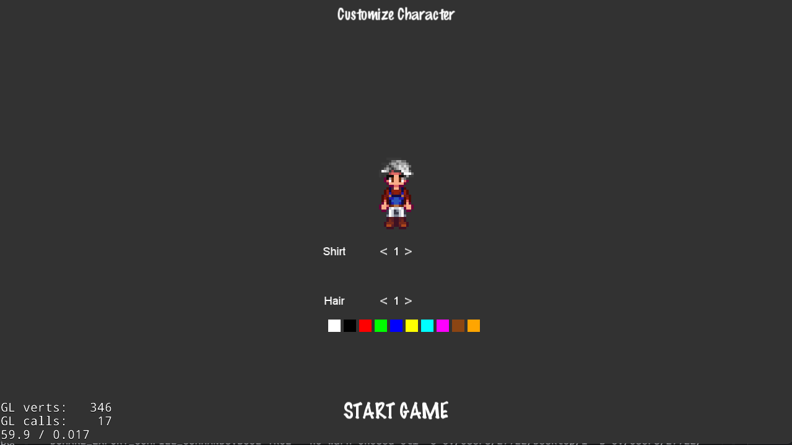

### 商店系统

- 城镇杂货店可购买种子/基础物资，也可出售农产品、矿物等换取金币。
- 农场动物商店可购买鸡/牛/羊等动物，购买后需要在农场选择位置放置。
- 买卖会影响金币与背包物品数量；部分购买行为也会消耗精力。
- 商店面板支持分类与分页，便于快速浏览与交易。
  

### 农场管理（作物 / Crop）

- 用锄头开垦土地后播种，随后使用水壶浇水推进生长。

- 作物在每天结算时成长；缺水会停滞或有概率枯死，换季不适合作物也会枯死。

- 成熟后可收获获得农产品；背包满时会以掉落物形式留在地面。

- 睡觉进入下一天会触发作物推进，并重置当天“已浇水”的状态。
  
  
  
  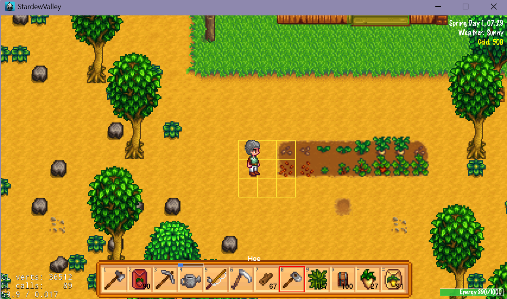

### 农场管理（动物 / Animal）

- 购买动物后会在农场游走，玩家可以靠近进行喂食。

- 喂食影响动物当日状态，并与每日产物（鸡蛋/牛奶/羊毛等）结算相关。

- 每天睡觉后结算成长与产物；不在农场时产物会延迟到回到农场后出现为掉落物。
  
  
  
  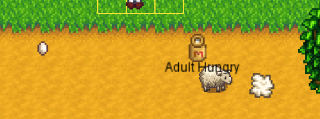

### 资源采集与环境障碍物

- 地图中分布树木、石头、矿石、杂草等可破坏/可采集的环境物。

- 使用对应工具进行采集，获得木材/石头/矿物/纤维等资源掉落，掉落物会显示在地图上，等待拾取。

- 掉落物可在地面拾取进入背包，用于后续合成、升级与交易。

- 当农场中的环境障碍物少于一定数量时，每天结束时会进行生长，增加一定量的环境障碍物（但不会破坏耕地、墙体、与其他环境障碍物）
  
  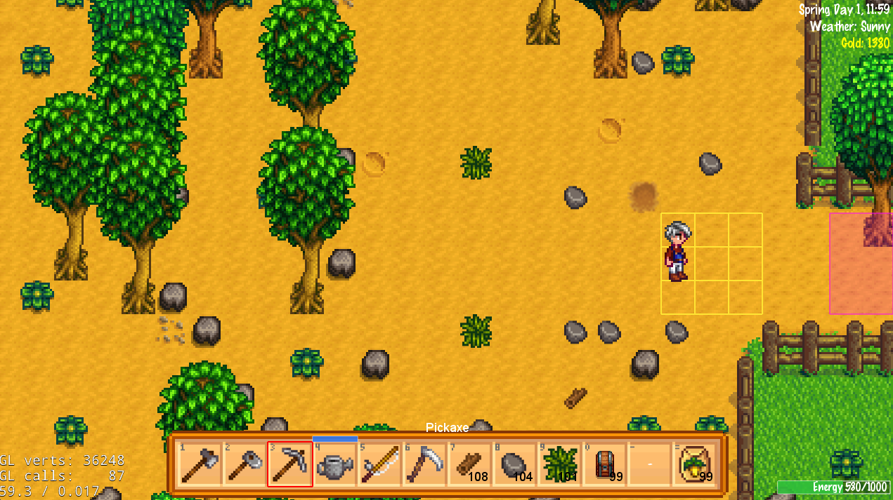

### 矿洞冒险（采矿）

- 进入矿洞后，每层都会生成矿石/石头/硬石等资源点，分布在可探索区域，各资源点的出现概率和所需敲击次数不同。

- 使用镐子等工具敲击矿点，可获得矿石、宝石与石头等掉落，部分矿点可能刷新隐藏楼梯。

- 楼层越深，矿物种类与稀有度越高，产出的矿石可以送往熔炉冶炼为金属锭，用于合成与工具升级，也可以售卖换钱。

- 采矿会持续消耗精力，需要在矿洞中合理安排路线，或返回农场休息补给。
  
  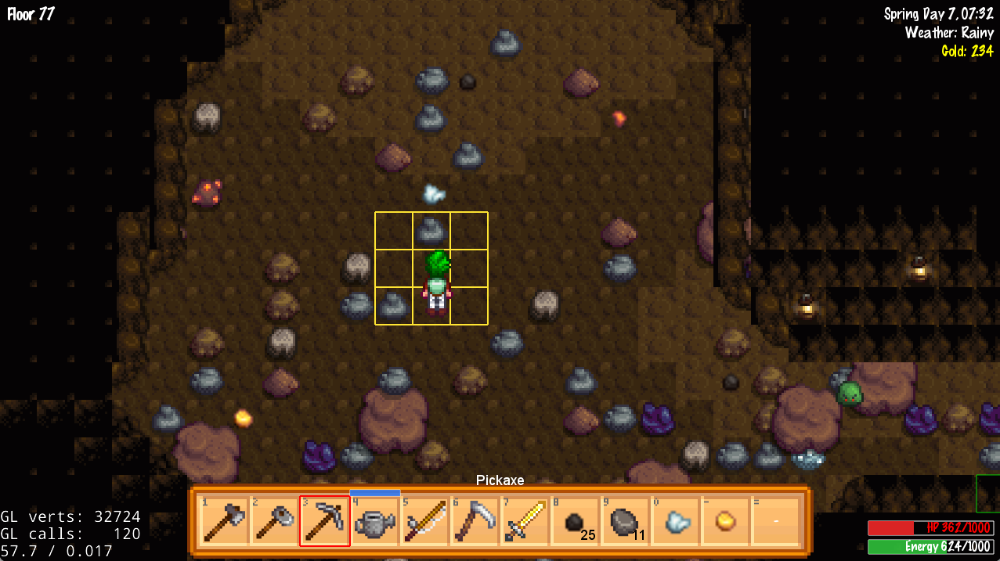
  
  

### 矿洞冒险（战斗）

- 每层都会刷新对应强度的怪物，每种怪物伤害、血量、速度、动画等属性都不同，玩家可使用武器进行攻击。

- 击败怪物可获得金币、经验与战利品掉落，部分怪物也可能掉落楼梯或特殊钥匙类道具。

- 通过楼梯向下推进楼层，每过5层会解锁一级电梯并获赠新的剑，电梯允许快速前往已解锁楼层，减少重复跑图。

- 战斗过程中需要同时关注生命值与精力，合理使用食物/药品，并在必要时撤退返回农场存档。
  
  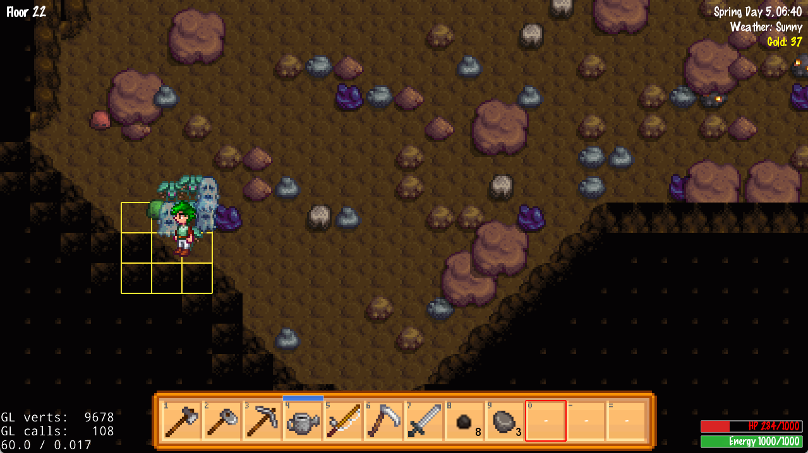
  
  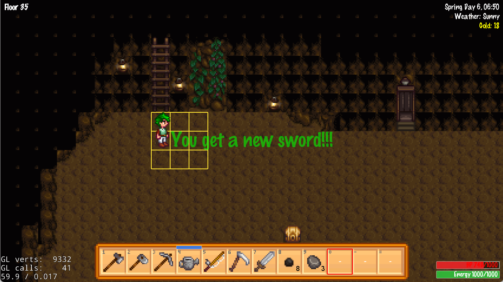
  
  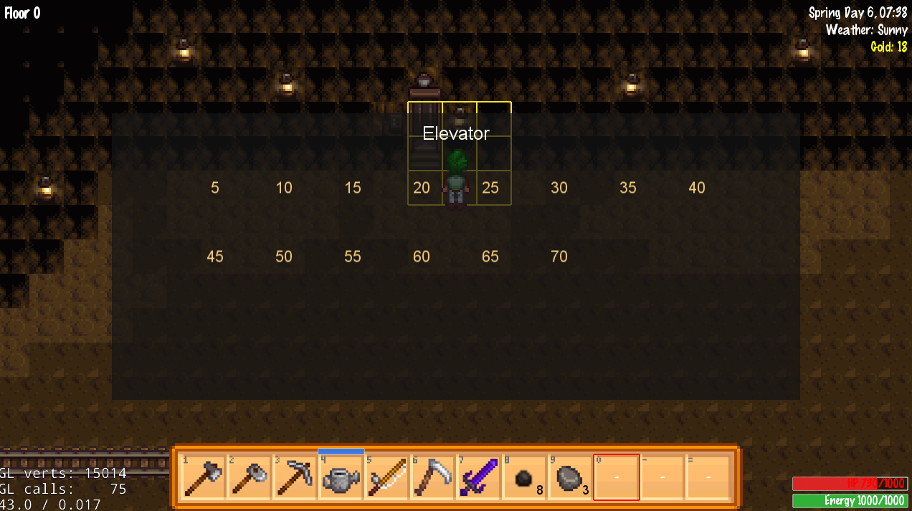

### 可放置物系统（箱子 / 熔炉）

- 玩家可以在农场等场景放置箱子，作为额外的储物空间。

- 靠近箱子并交互可打开箱子面板，在背包与箱子之间自由搬运物品；箱子内容会随存档长期保留。

- 熔炉同样属于可放置物，放置后可以向其中投入矿石与燃料，启动熔炼计时。

- 熔炼完成后会在熔炉附近生成金属锭等掉落物，玩家拾取后进入背包，用于后续合成与工具升级。

- 箱子与熔炉的放置都遵循统一的占位与碰撞规则，避免阻挡玩家必经路径或重叠放置。

- 在农场中，玩家使用斧头可移除空箱子（若箱子内有物品则无法移除），使用镐子可以移除空闲状态的熔炉。
  
  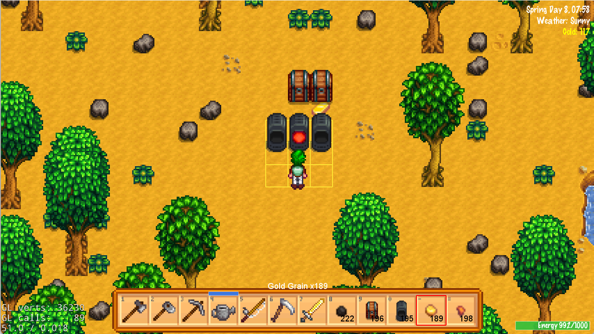
  
  

### 合成系统（Crafting）

- 按 `C` 打开合成面板，支持配方分类与分页浏览，便于快速找到目标配方。

- 配方以“材料列表 → 产物”的形式展示，并会显示当前背包内对应材料的拥有数量。

- 点击合成会消耗材料并生成成品（如箱子/熔炉/食物等），用于扩展储物、冶炼与战斗补给等玩法闭环。

- 合成结果会即时反馈到背包与 UI 显示，便于连续制作与资源规划。
  
  

### 工具升级系统

- 工具（锄头、镐子、斧头、浇水壶）拥有多级品质，等级越高，效率和作用范围越好。

- 通过工具升级面板，玩家可以查看当前每种工具的等级以及下一次升级所需的金币与金属锭材料。

- 若背包和全局箱子中的材料与金币满足要求，点击升级按钮将消耗对应资源，并立刻提升工具等级（最高 3 级）。

- 升级成功后会刷新背包与热键栏显示，使高等级工具在采矿、伐木、耕地与浇水等操作中体现明显差异。

- 满级工具可以一次性对面前的 3*3 范围进行操作（使用Ctrl+左键），也可与低级工具一样对单个格子进行操作（左键）。
  
  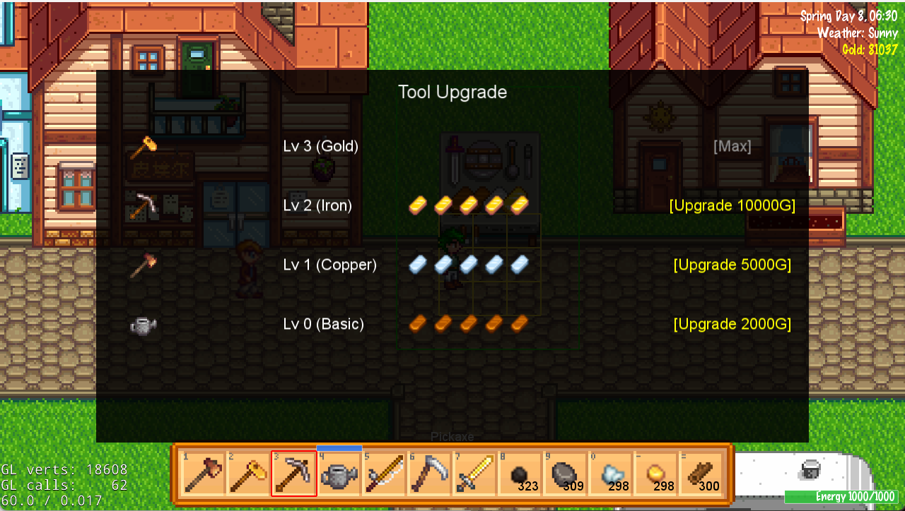
  
  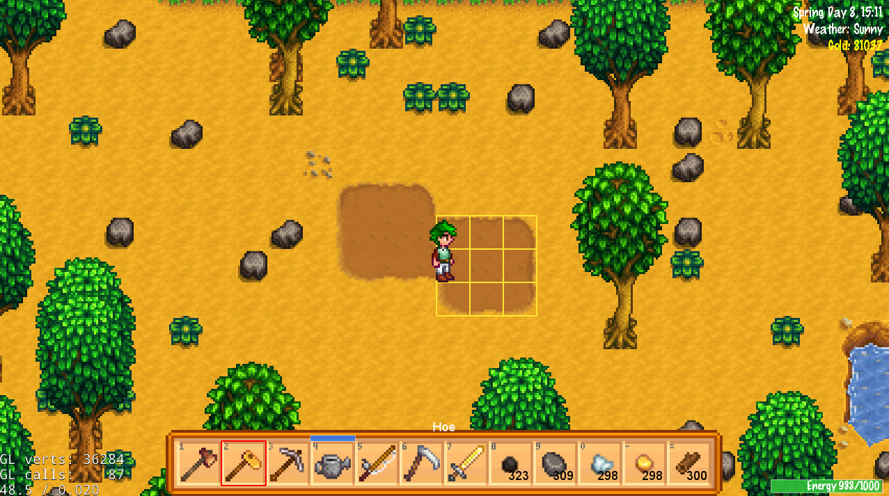

### 技能树系统（SkillTree）

- 按 `L` 打开技能面板，展示种地/养殖/砍树/钓鱼/采矿/战斗等技能树的等级、经验与当前加成描述。

- 不同行为会累积对应技能经验（如收获作物、动物产物结算、挖矿与战斗等）。

- 等级提升会带来对应玩法的概率/数量加成（如额外收获、额外掉落或额外金币等）。

- 技能加成在系统结算时生效，并通过 UI 面板可随时查看当前收益与升级进度。
  
  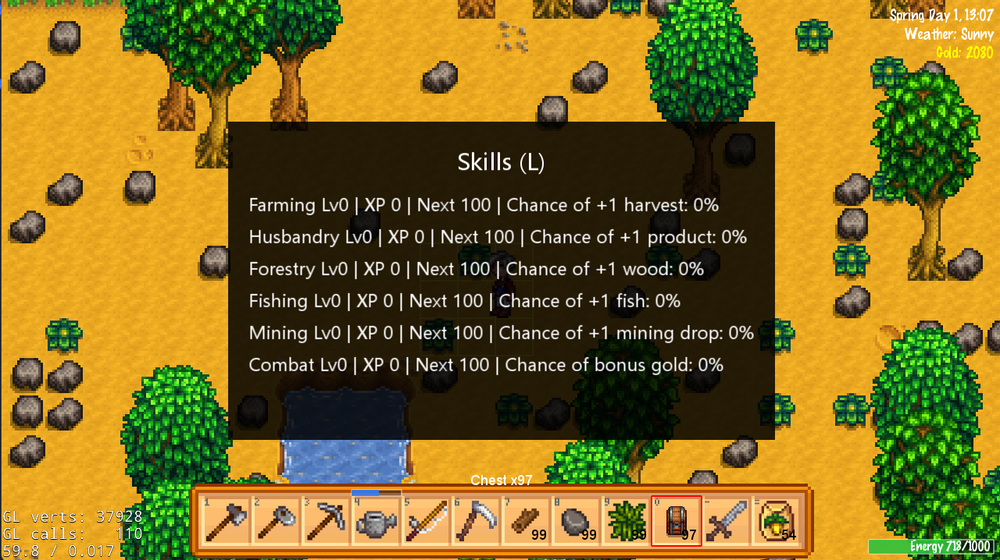

### 时间 / 天气 / 日结

- 游戏时间持续流逝，驱动一天的行动节奏；睡觉进入下一天并触发各类每日结算。

- 天气以晴天/雨天为主：雨天有对应的显示效果，会改变户外地图的氛围与移动手感，并自动将耕地视为“已浇水”。

- 特定节日当天保证晴天，避免活动受到天气影响。

- 每天的17:30会开始天黑，此时户外地图的亮度会逐渐变暗，直到19:00时达到最暗

- 若玩家晚于0点睡觉，会触发晕倒，扣除金币并自动进入第二天，在房间的床上醒来
  
  

### 存档系统（SaveSystem）

- 游戏支持多存档槽位，可在主菜单选择不同存档进行加载与覆盖。

- 按 `F5` 可在大部分场景快速存档，方便在关键节点前手动保存进度。

- 每日结束时（睡觉 / 晕倒 / 矿洞内血量清零）会自动进行存档，确保时间推进与资源消耗被记录。

- 存档会记录地图状态、作物/动物、玩家属性、背包与箱子物品、季节/时间/天气以及 NPC 好感度等长期进度。 

  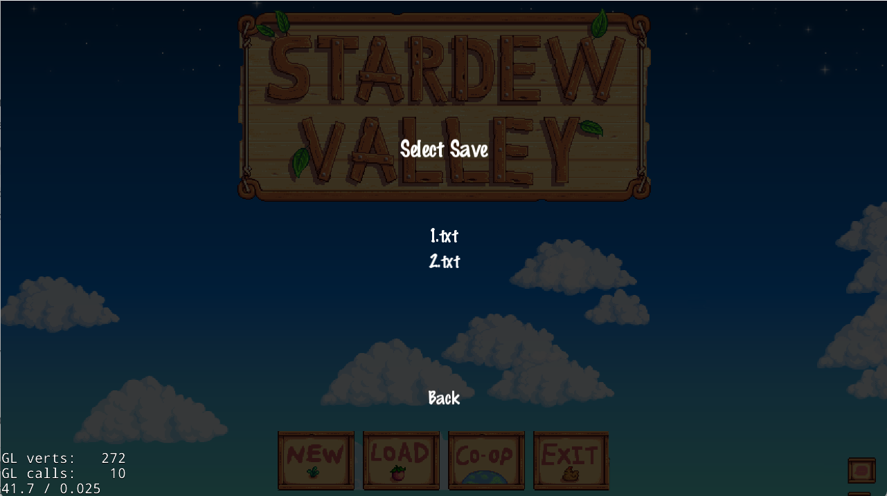

### 季节系统

- 游戏共 4 个季节：春/夏/秋/冬

- 每个季节都有对应的户外地图（农场、城镇、海滩），与原游戏相同。（为节省篇幅以下只展示农场地图的变化）

- 季节会对环境障碍物（树）的外观产生影响，与原游戏相同。

- 农作物有对应的可种植季节，玩家只能在对应季节种植，否则无法种植。如果是正在生长的作物，换季时会枯死。

- 季节会自动循环，每个季节结束后会触发下一个季节的开启。
  
  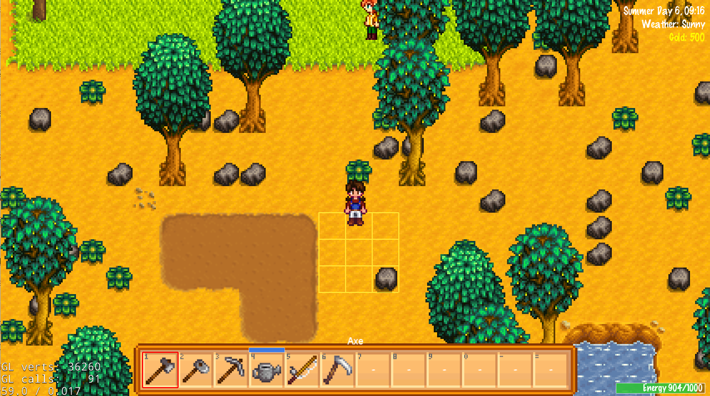
  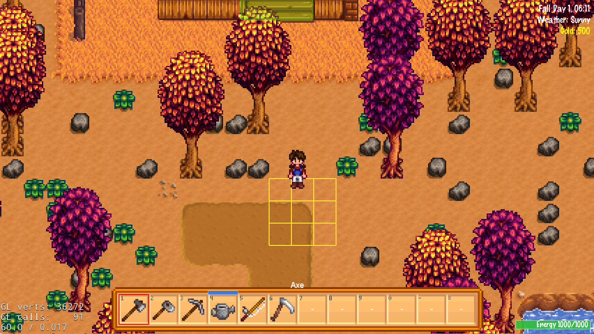
  

### 社交系统（NPC / 对话 / 好感度）

- 城镇/农场/海滩分布不同 NPC，可通过对话了解剧情与触发交互选项。

- 好感度会随对话与赠礼提升；赠礼存在“每日一次”的限制，避免无限刷好感。

- 社交面板可查看 NPC 的基础信息、好感与关系状态。

- 节日会在特定日期开启，城镇/海滩出现活动布置与特殊交互内容。
  
  

### 节日系统

- 夏季的第六日定义为钓鱼节，此时海滩会出现水母图案，并可钓上特殊鱼种

- 此时城镇喷泉旁也会出现特殊贴图
  
  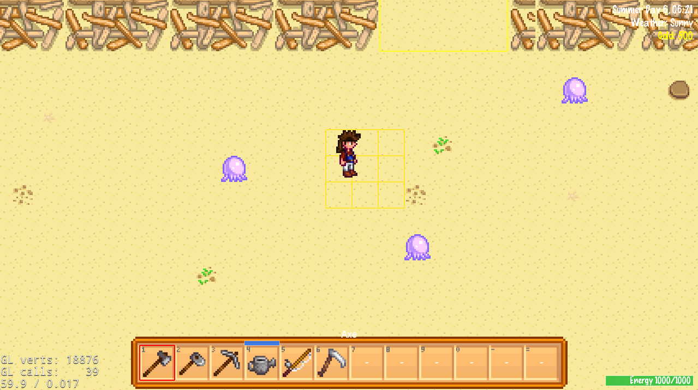

### 钓鱼系统（Fishing）

- 在水边使用钓鱼竿开始钓鱼小游戏，通过按住/松开控制捕获条位置。

- 捕获条与鱼影重叠越多，进度增长越快；进度满则钓鱼成功并获得鱼与经验。

- 特定节日提供“节日钓鱼”玩法与限定鱼种奖励。
  
  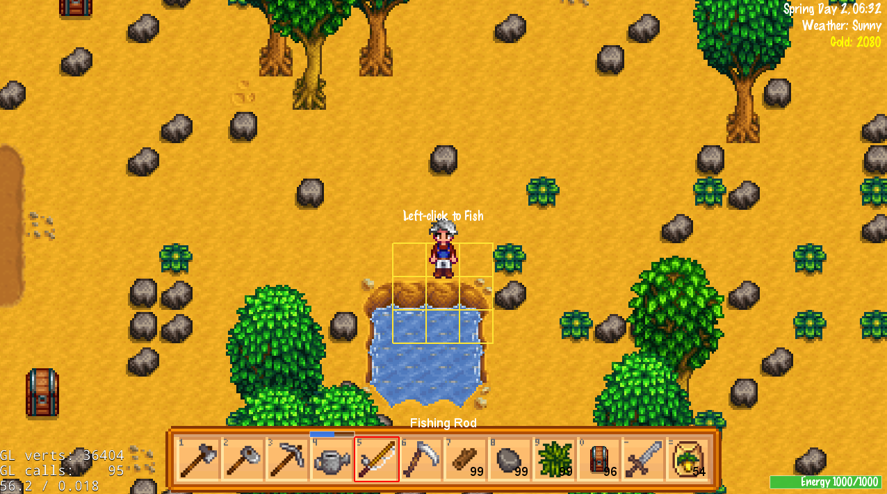
  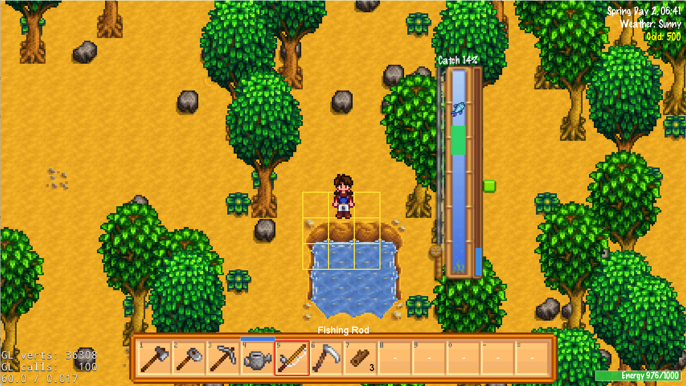

### 音乐系统（BGM）

- 不同场景会播放不同的背景音乐，切换场景时自动切歌以增强氛围。
- 音频播放避免重复触发与突兀切换，保证整体体验稳定流畅。

## 操作说明（默认按键）

- 移动：`WASD` / 方向键（按住一段时间会自动加速）
- 场景切换：
  - 在地图中存在部分被框选的部分，在被框选出的部分按空格即可实现场景的切换
  - 在矿洞中，可以通过在stair旁按空格进入下一层，在上升的阶梯旁按空格回到顶层
  - 在矿洞顶层电梯旁按空格可打开电梯界面，可使用电梯传送至五的整数倍层
- 睡觉：在房间的床上按空格可进行睡觉，进入第二天
- 工具使用：
  - 物品栏选中工具时，左键 3*3 黄色候选框内的格子，即可对对应格子使用工具
    - 斧头对树根使用，可将树砍倒；对农场中的空箱子使用可移除空箱子
    - 锄头对**可耕种**的土地块使用，可进行锄地，将土地变为可种植状态
    - 镐子对石头使用，可进行敲除；对锄过的土地使用，可变回未锄地状态
    - 水壶可对锄过的土地浇水；水壶水量有限，水量归零时可到水边使用左键接满水
    - 钓鱼竿可在水边左键，进入钓鱼小游戏
    - 剑可使用左键，对面前 3*3 格子的怪物造成伤害；剑必须要进入矿洞后才能获得
  - 或可按空格使用工具，对面前的单个候选格使用工具
  - 在城镇场景中，存在一个工作台（有框出），在框出范围内按空格，即可打开工具升级界面，可以消耗矿物锭和金币，对工具进行升级
- NPC / 社交：
  - `Space`：与附近 NPC 交互（对话 / 赠礼，取决于当前是否手持可赠送物品）
  - 鼠标右键点击 NPC：打开社交面板（部分 NPC）/ 直接打开商店（如 Pierre）
- 对话框：
  - 鼠标点击对话框区域：推进下一句（无选项时）
  - 鼠标点击选项按钮：选择分支（有选项时）
- 物品栏：
  - 切换选中：鼠标滚轮 / 键码 `1`~`=` / 鼠标左键对应物品
  - 按 `E` 可打开背包界面，物品栏放不下的物品会自动存放到背包中，背包的操作与箱子相同；按 `Esc` 关闭背包
- 面板：
  - `C`：合成面板，合成面板上方可选择合成 可放置物 或 食物，左键进行二者切换，可合成可放置物或食物
  - `L`：技能树面板
  - `Esc`：关闭当前面板；无面板时会存档并返回主菜单
- 存档：
  - `F5`：快速存档
  - 每日结束时（睡觉/晕倒/矿洞内血条清零），会自动进行存档
- 箱子：
  - 在农场左键空格子（不可以是墙体/耕地）放置箱子，右键打开箱子
  - 可使用斧子左键空箱子，对空箱子进行移除，并将其变为可拾取的掉落物
- 熔炉：
  - 在农场左键空格子（不可以是墙体/耕地）放置熔炉，在背包/物品栏中有燃料（煤）时，手持矿粒左键熔炉，即可对矿粒进行熔炼，在等待一段时间后，矿粒会被熔炼为矿物锭，并作为掉落物出现在熔炉后方。
  - 可使用镐子左键空闲状态的熔炉，对熔炉进行移除，并将其变为可拾取的掉落物
- 作物：
  - 手持种子，左键已使用锄头锄过的土地，可进行种植
  - 作物成熟后，手持锄头，对成熟作物左键，可收获作物
  - 对成熟状态手滑后，回到未成熟状态的作物使用锄头，可将作物铲除
- 动物喂食：
  - 在动物身旁，手持动物饲料（鸡为任意种子，牛/羊为成熟的防风草）按空格，可对最近的未喂食过的动物进行喂食，喂食后动物上方提示会变为 `full`
- 其它：
  - `F`：食用当前选中可食用物品
  - `Q`：丢弃/放置当前选中物品（与地图/选中物品类型有关）
  - `Ctrl`：工具距离修饰键（仅对满级（金色）工具生效，按住时把单格锄地/浇水/采集改为 3*3 多格范围）
  - `Shift`：在箱子界面按住再点击物品格，可搬运整叠物品
- 开发用快捷键
  - 按 `Z` 发放基础物资，可到背包中查看
  - 按 `T` 将时间快进一小时，可快速进入夜晚
  - 按 `G` 快速获取三种动物，注意只可在农场中使用，且使用时要注意远离墙体，以免动物卡在墙里
  - 按 `X` 可推进面前一格的作物的生长状态到下一状态
  - 按 `N` 可在矿洞里快速下到下一层

说明：具体操作以 `Classes/Controllers/Input/PlayerController.cpp` 为准。

## 存档位置

存档通过 `Classes/Game/Save/SaveSystem.*` 写入文本文件，默认目录为 可执行文件（.exe） 同级目录下的 `save/` 文件夹（通过 `FileUtils::getInstance()->getWritablePath()` 计算），支持英文命名。

## 类的架构

本项目在代码层面整体遵循“场景骨架 + 控制器/系统 + 游戏数据 + UI”的分层设计，尽量做到高内聚、低耦合。下面从几个主要维度简要说明类的架构与协作关系。

### 场景层（Scenes）

- 场景基类：`Classes/Scenes/SceneBase.*` 是所有具体场景的唯一基类，负责：
  - 创建并持有通用控制器（地图、玩家、作物、天气、节日、钓鱼、UI 等）。
  - 搭建 worldNode / UI 根节点等挂载点。
  - 在 `update` 中统一驱动各控制器与系统的帧更新。
- 具体场景：`FarmScene`、`RoomScene`、`TownScene`、`BeachScene`、`MineScene` 等（位于 `Classes/Scenes/*`）仅负责：
  - 指定使用的地图控制器实现（农场/城镇/矿洞 TMX 等）。
  - 根据场景需求按需创建额外的控制器或系统（如矿洞战斗、电梯、怪物控制器等）。
  - 覆盖少量与该场景强相关的钩子（例如场景进入/离开时的初始化或清理）。
- 设计原则：所有业务规则（掉落计算、战斗数值、作物成长等）不直接写在场景类中，而是下沉到 Controllers/System/Game 层，场景只承担“骨架 + 调度 + 事件转发”的职责。

**关键类示例（`Classes/Scenes`）**

- `SceneBase`：场景骨架与调度中心，持有通用控制器与 world/UI 根节点。
- `FarmScene`：农场室外场景，组合 `FarmMapController`、作物/动物系统并挂接农场专用 UI。
- `RoomScene`：室内/房间场景，负责与房间地图控制器、室内交互器协作。
- `TownScene`：城镇场景，聚合 NPC/商店/节日等与 `TownMapController` 的交互。
- `BeachScene`：海滩场景，承载钓鱼、节日活动等，与海滩地图控制器协作。
- `MineScene`：矿洞场景，组合 `MineMapController`、矿洞战斗/怪物/电梯等控制器。

### 控制器层（Controllers / Interactors / Managers）

控制器层负责“流程编排与输入转发”，是场景与底层系统之间的中介。

- 地图控制器：
  - 抽象接口：`Controllers::IMapController` 位于 `Classes/Controllers/Map/*`，统一封装 TMX 地图加载、坐标转换、碰撞检测、地块属性查询、楼层切换等能力。
  - 具体实现：`FarmMapController`、`TownMapController`、`MineMapController` 等分别服务于不同场景，但都通过 `IMapController` 暴露统一接口，场景与系统只依赖抽象。
- 玩家与输入控制器：
  - `PlayerController`（`Classes/Controllers/Input/PlayerController.*`）集中处理键盘/鼠标输入、移动、工具使用触发等，将“玩家按键”转换为对 Tool / System 的调用。
  - 与背包、UI 交互：通过接口与背包系统、UI 面板协作，而不直接操作底层容器。
- 玩法控制器与交互器：
  - 例如 `Classes/Controllers/Mine/*` 下的一组控制器/交互器负责矿洞战斗、电梯、宝箱、楼层事件等，它们更多做“命中结果 → 调用 System/Drop/UI”的调用顺序编排。
  - 合成、商店、社交等模块也有各自的 Controller/Interactor（如 `CraftingController`、`StoreController`、各类 *Interactor），负责把 UI 操作或输入事件翻译成对系统层的调用。
- 管理类（Manager）：
  - 典型如 `AudioManager`（`Classes/Controllers/Managers/AudioManager.*`），集中管理 BGM/音效的播放、切换与资源复用，对外提供简单接口（播放/停止/切换），内部自行维护状态。
  - 其他 Manager 类也遵循类似模式：提供清晰接口，内部隐藏具体实现与资源管理。

**关键类示例（`Classes/Controllers`）**

- `PlayerController`（Input）：负责采集玩家输入、移动与工具使用触发，是“输入入口”。
- `UIController`（UI）：统一创建和管理 HUD/背包栏/各类面板，是 UI 的聚合入口。
- `StoreController`（Store）：处理商店买卖逻辑，与 `StorePanelUI`、`WorldState` 协作修改金币与物品。
- `CraftingController`（Crafting）：处理合成配方查询与合成结果生成，驱动背包与合成 UI。
- `WeatherController` / `FestivalController`（Systems）：围绕 `WorldState` 驱动天气变化与节日开关。
- `FishingController`（Systems）：管理钓鱼小游戏流程，与 `PlayerController` 输入与鱼行为/掉落系统协作。
- `MineMapController` / `FarmMapController` / `TownMapController`（Map）：封装各自场景的 TMX 地图与碰撞/坐标转换。
- 矿洞相关控制器（`Classes/Controllers/Mine/*`）：
  - 典型如战斗控制器、怪物控制器、电梯控制器、矿洞交互器等，负责把命中结果分发给 `DropSystem`、经验系统与 UI。

### 系统层（Systems）

系统层主要负责“状态唯一来源”和“规则实现”，对同一类业务实体提供集中管理。

- 作物与动物：
  - `CropSystem`（`Classes/Controllers/Systems/CropSystem.*`）管理所有地块作物生长状态，是作物相关数据的唯一来源，负责每日推进、浇水状态、成熟与枯死等规则。
  - `AnimalSystem`（`Classes/Controllers/Systems/AnimalSystem.*`）集中管理农场动物的状态、产物结算等。
- 时间、天气与节日：
  - `WeatherController` 与 `FestivalController`（位于 `Classes/Controllers/Systems/`）共同围绕 `WorldState` 驱动每日天气变化、节日开启与关闭等。
  - 这些控制器更多承担“系统级规则”，与具体场景解耦。
- 工具与升级：
  - `ToolUpgradeSystem`（`Classes/Controllers/Systems/ToolUpgradeSystem.*`）负责工具升级消耗、条件校验与升级结果写回，避免把升级规则散落在 UI 或场景中。
- 掉落与可放置物：
  - `DropSystem`（`Classes/Controllers/Systems/DropSystem.*`）负责统一生成、管理与回收地图上的掉落实体，避免各业务模块各自维护掉落列表。
  - `PlaceableItemSystemBase` / `ChestController` 等处理可放置物体（如箱子）的状态与与挂载节点。
- 环境障碍物系统：
  - 所有树木、石头、矿石、杂草、楼梯等环境实体由 `EnvironmentObstacleSystemBase` 的子类统一管理（目录 `Classes/Controllers/Environment/*`），例如矿石相关的 `MineralSystem`。
  - 这些 System 既是状态唯一来源，也是对应 Cocos 节点（sprite/DrawNode）的唯一 owner，负责生成、更新与销毁节点，并通过接口向控制器暴露命中/破坏/掉落等结果。

**关键类示例（`Classes/Controllers/Systems` 与 `Environment`）**

- `CropSystem`：唯一管理作物状态与可视节点，负责每日推进、浇水/枯死/成熟等规则。
- `AnimalSystem`：集中管理动物状态、喂食与产物结算，并驱动对应节点更新。
- `ToolUpgradeSystem`：处理工具升级条件、消耗与结果写回（更新工具等级与属性）。
- `DropSystem`：统一管理掉落物生成/更新/销毁和地图挂载，是掉落状态唯一来源。
- `PlaceableItemSystemBase`：可放置物体（如箱子）的通用系统基类。
- `ChestController`：基于 `PlaceableItemSystemBase` 管理箱子放置、打开/关闭与存取物。
- `EnvironmentObstacleSystemBase`：环境障碍物系统抽象基类，统一定义生成/更新/销毁接口。
- `MineralSystem` 等环境子系统：分别管理矿石、树木、石头、杂草等具体环境实体。

### 游戏数据与规则层（Game）

`Classes/Game/*` 目录下主要是与具体引擎无关的游戏数据结构与规则定义，尽量保持“无场景、无 UI、弱引擎依赖”：

- 全局状态：`Game::WorldState` 作为全局游戏状态的唯一来源，包含背包、地图瓦片、作物/动物、NPC 好感度、时间/天气等核心数据，通过 `globalState()` 访问。
- 道具与配方：`Classes/Game/Item/*`、`Classes/Game/Recipe/*` 定义了物品基础属性、堆叠规则、合成配方等。
- 生物与战斗：`Classes/Game/Monster/*`、玩家与怪物的数值结构等，描述生命值、攻击力、经验、掉落表等战斗相关规则。
- 存档：`Classes/Game/Save/SaveSystem.*` 负责将 `WorldState` 读写到磁盘，并处理版本演进与兼容。

**关键类示例（`Classes/Game`）**

- `Game::WorldState`：全局状态唯一来源，持有背包、时间、季节、天气、地图瓦片、作物/动物、NPC 状态等。
- 物品相关：
  - 基础物品/堆叠结构（如物品 ID、数量、品质等）用于背包与掉落。
  - 合成配方/配方表（`Recipe` 等）描述输入→输出的规则。
- 怪物与战斗相关数据结构：定义怪物基础属性、掉落表、经验与战斗行为参数。
- `SaveSystem`：负责把 `WorldState` 序列化/反序列化到文本存档，并处理版本兼容。

### UI 层（UI）

UI 层以 `UIController` 为核心入口，将各个独立 UI 面板组织成一个整体：

- UI 聚合入口：
  - `UIController`（`Classes/Controllers/UI/UIController.*`）在场景创建时由 `SceneBase` 创建并持有，负责初始化 HUD/背包栏/提示气泡/各类面板，并与 `PlayerController`、各 System 协作刷新显示。
- 具体 UI 面板：
  - 商店 UI：`StorePanelUI`（`Classes/Controllers/UI/StorePanelUI.*`）。
  - 社交 UI：`NpcSocialPanelUI`、`DialogueUI` 等。
  - 其他如技能、合成、箱子等面板也各自有独立类，遵循“单一面板单一类”的原则，通过 `UIController` 或对应 Controller 进行打开/关闭与数据刷新。
- 与系统协作方式：
  - UI 层不直接修改底层数据结构，而是通过 Controller/System 提供的接口完成购买、制作、赠礼、取物等操作；UI 只负责展示与输入采集。

**关键类示例（`Classes/Controllers/UI`）**

- `UIController`：全局 UI 管理入口，持有 HUD、背包栏及各类面板的实例。
- `StorePanelUI`：商店 UI，展示可购买/可出售物品，并与 `StoreController` 协作完成交易。
- `NpcSocialPanelUI`：社交面板 UI，展示 NPC 基本信息与好感度。
- `DialogueUI`：对话框 UI，负责台词显示与选项交互。
- 其他如技能面板、合成面板、箱子面板等，各自对应独立 UI 类，由 `UIController` 或相关 Controller 负责打开/关闭与数据刷新

## 各功能的具体实现

### 作物（Crop）

- 状态唯一来源：`CropSystem`（`Classes/Controllers/Systems/CropSystem.*`）持有作物运行时列表并同步写回 `WorldState`，对外仅暴露“种植/浇水/推进/收获”等接口。
- 静态定义与映射：`Game::CropBase` / `Game::CropDefs`（`Classes/Game/Crops/crop/CropBase.*`）提供阶段天数、季节适配、回生属性，以及“种子/产物”物品映射。
- 交互入口：
  - 播种：`FarmInteractor`（`Classes/Controllers/Interact/FarmInteractor.*`）在玩家选中种子时调用 `CropSystem::plantCrop`，并触发地图作物可视刷新。
  - 收获：`Hoe`（`Classes/Game/Tool/Hoe.*`）与 `CropSystem::harvestByHoeAt` 协作计算产物与数量（含技能树加成），再由上层将结果落入背包或掉落系统。
- 日结推进：`CropSystem::advanceCropsDaily` 在“睡觉进入下一天”时被调用，统一处理浇水复位、阶段推进、枯死与回生等分支。

**关键类示例（Crop）**

- `CropSystem`：作物规则与状态唯一来源，统一承载种植/推进/收获。
- `Game::Crop` / `Game::CropType`：作物运行时状态与类型枚举。
- `Game::CropDefs` / `Game::CropBase`：作物静态定义与类型→规则查询入口。
- `FarmInteractor`：把“种子选中 + 交互输入”翻译为作物系统调用。

### 农场耕地（Farm Tilling）

- 状态唯一来源：
  - 农场地表的耕作状态由 `WorldState::farmTiles` 维护（`Classes/Game/WorldState.h`），元素类型为 `Game::TileType`，在农场加载时由 `FarmMapController` 读入到 `_tiles` 并在修改后写回。
- 静态定义与映射：
  - `Game::TileType`（`Classes/Game/Tile.h`）枚举 `Soil` / `Tilled` / `Watered` / `NotSoil`，分别代表可耕未翻地、已翻地、已浇水耕地与不可耕作区域。（农场以外的其他地图的所有瓦片均为NotSoil，即不可耕种。
  - `FarmMapController::applyStaticNotSoilMask`（`Classes/Controllers/Map/FarmMapController.cpp`）在初始化时遍历 `_tiles`，结合 TMX 的建筑/道路区域将对应格子标记为 `NotSoil`，保证不可耕区域在数据层固定。
- 交互入口：
  - 锄地：`Game::Hoe::use`（`Classes/Game/Tool/Hoe.cpp`）在农场地图上，被选中格子的 `TileType` 为 `Soil` 且不存在树/石头/杂草/箱子/熔炉时，将其设置为 `Tilled`，若当日下雨则直接设置为 `Watered`，并刷新地图与 HUD。
  - 铲平：`Game::Pickaxe::use`（`Classes/Game/Tool/Pickaxe.cpp`）在命中格子无作物时，可将 `Tilled` / `Watered` 还原为 `Soil`，用于整理农田。
  - 浇水：`Game::WaterCan::use`（`Classes/Game/Tool/WaterCan.cpp`）在农场地图上，被选中格子的 `TileType` 为 `Tilled` 时，将其设置为 `Watered`，并刷新地图与 HUD。
  - 日结回退：`CropSystem::advanceCropsDaily`（`Classes/Controllers/Systems/CropSystem.h`）在每日推进时会把所有 `Watered` 瓦片回退为 `Tilled`，形成“浇水仅当日有效”的规则闭环。
- 可视化：
  - `FarmMapController` 在初始化时创建 `_tileRoot` 以及 `_tileSprites` / `_waterSprites`（`Classes/Controllers/Map/FarmMapController.*`），根据 `_tiles` 中的 `Tilled` / `Watered` 状态绘制覆盖贴图，使锄过地与浇水效果在地图上可见。

**关键类示例（Farm Tilling）**

- `Game::TileType`：地块可耕/耕地/浇水/不可耕枚举。
- `WorldState::farmTiles`：农场地块状态的持久化容器。
- `FarmMapController`：维护 `_tiles`、负责 `getTile` / `setTile` 与耕地可视化。
- `Game::Hoe` / `Game::WaterCan` / `Game::Pickaxe`：通过 `use` 逻辑驱动锄地、浇水与铲平。

### 动物（Animal）

- 状态唯一来源：`AnimalSystem`（`Classes/Controllers/Systems/AnimalSystem.*`）维护动物运行时列表（位置/目标/成长/喂食）并同步写回 `WorldState::farmAnimals`，同时作为精灵节点与状态标签的唯一 owner。
- 静态定义：
  - 数据结构：`Game::AnimalType` / `Game::Animal` 与 `Game::animalPrice` 位于 `Classes/Game/Animals/Animal.h`。
  - 行为常量：`Game::AnimalBase`（`Classes/Game/Animals/AnimalBase.h`）的派生类（`ChickenAnimal`/`CowAnimal`/`SheepAnimal`）提供速度、游走半径与贴图路径，系统侧按 `AnimalType` 索引获取。
- 交互入口：
  - 喂食：`FarmInteractor` 调用 `AnimalSystem::tryFeedAnimal` 只返回“建议消耗数量”，背包扣除仍由上层完成以避免系统耦合背包细节。
  - 购买：动物商店面板 `AnimalStorePanelUI`（`Classes/Controllers/UI/StorePanelUI.*`）通过回调驱动 `AnimalSystem::buyAnimal`（价格通常来自 `Game::animalPrice`）扣费并生成；面板的打开入口由 NPC 交互接口 `NpcControllerBase`（`Classes/Controllers/NPC/NpcControllerBase.*`）触发。
- 日结推进：`advanceAnimalsDaily`（`Classes/Controllers/Systems/AnimalSystem.*`）统一处理成长结算与当日产物生成（落地到掉落系统或写入离线掉落）。

**关键类示例（Animal）**

- `AnimalSystem`：动物状态唯一来源，统一管理游走/喂食/产物与可视节点生命周期。
- `Game::Animal` / `Game::AnimalType` / `Game::animalPrice`：动物数据结构与定价（`Classes/Game/Animals/Animal.h`）。
- `Game::AnimalBase` 与 `ChickenAnimal`/`CowAnimal`/`SheepAnimal`：动物静态行为定义（贴图/速度/游走半径）。
- `advanceAnimalsDaily`：动物每日结算入口（成长 + 产物生成）。
- `AnimalStorePanelUI`：动物购买 UI，使用回调解耦扣费与生成逻辑。

### 怪物（Monster）

- 状态唯一来源：`MineMonsterController`（`Classes/Controllers/Mine/MonsterSystem.*`）维护矿洞内所有怪物的运行时列表（位置/速度/当前 HP/攻击冷却），并负责与 `MineMapController` 同步碰撞体和与世界节点同步精灵。
- 静态行为定义：`Game::MonsterBase` 及其派生类（`GreenSlime` / `BlueSlime` / `RedSlime` / `Bug` / `Ghost` 等，位于 `Classes/Game/Monster/*`）提供每种怪物的基础属性（血量/攻击/移动速度/搜敌范围）和动画接口，通过 `monsterInfoFor(MonsterType)` 统一查询。
- 交互入口：
  - 近战攻击：`MineCombatController`（`Classes/Controllers/Mine/CombatSystem.*`）在鼠标左键按下时读取当前选中的 `Game::Sword`，通过 `Game::Sword::buildHitTiles` 构建前方扇形瓦片列表，并调用 `MineMonsterController::applyAreaDamage` 结算怪物伤害与死亡（经验/掉落由怪物系统内部通过 `SkillTreeSystem`、`DropSystem` 等模块完成）。
  - 怪物反击：`MineMonsterController::update` 每帧根据玩家位置驱动怪物移动与接触伤害，更新玩家生命值写回 `WorldState`，并在玩家死亡时清空怪物。

**关键类示例（Monster）**

- `MineMonsterController`：怪物运行时状态唯一来源，负责刷怪/移动/攻击/死亡。
- `Game::MonsterBase` / `monsterInfoFor`：怪物静态配置与动画接口。
- `GreenSlime` / `BlueSlime` / `RedSlime` / `Bug` / `Ghost`：具体怪物行为实现。
- `MineCombatController`：把玩家攻击输入翻译为对怪物系统的范围伤害调用。

### 农场的环境障碍物（Environment Obstacles）

- 状态唯一来源：
  - `EnvironmentObstacleSystemBase`（`Classes/Controllers/Environment/EnvironmentObstacleSystemBase.h`）定义 `attachTo` / `spawnFromTile` / `spawnRandom` / `collides` / `damageAt` / `isEmpty` 等抽象接口，所有环境障碍系统以该接口作为“唯一来源”的约束。
  - 农场树/石头/杂草分别由 `TreeSystem` / `RockSystem` / `WeedSystem`（`Classes/Controllers/Environment/*.h`）维护运行时容器和 `WorldState::farmTrees` / `farmRocks` / `farmWeeds` 的读写，只通过系统接口生成/移除节点。
- 静态定义与映射：
  - 树：`Game::Tree` / `Game::TreeKind` / `Game::TreePos`（`Classes/Game/EnvironmentObstacle/Tree.h`）描述单棵树的节点行为与存档数据，`TreeKind` 控制季节贴图与 HP。
  - 石头：`Game::Rock` / `Game::RockKind` / `Game::RockPos`（`Classes/Game/EnvironmentObstacle/Rock.h`）提供石头种类、贴图、HP 与位置持久化。
  - 杂草：`Game::Weed` / `Game::WeedPos`（`Classes/Game/EnvironmentObstacle/Weed.h`）描述杂草节点与其在地图上的位置。
- 生成与恢复：
  - 初始生成：`TreeSystem::generateInitial` / `RockSystem::generateInitial` / `WeedSystem::generateInitial` 在农场加载时，根据可种植区域、建筑遮罩与占位回调在地图上随机生成初始障碍，并通过 `markOccupiedTile` 避免互相重叠。
  - 存档恢复：`FarmMapController::init`（`Classes/Controllers/Map/FarmMapController.cpp`）在系统为空且 `WorldState` 中已有 `farmTrees` / `farmRocks` / `farmWeeds` 时，遍历存档数据调用 `spawnFromTileWithKind` / `spawnFromTile` 重建节点。
  - 夜间补充：`TreeSystem::regrowNightlyWorldOnly` / `RockSystem::regrowNightlyWorldOnly` / `WeedSystem::regrowNightlyWorldOnly` 根据当前占用情况向 `WorldState` 追加新障碍，模拟“树木/石块/杂草再生”。
- 碰撞与受击：
  - 碰撞：各 System 实现 `collides`，通过内部索引与脚底矩形实现玩家/实体与障碍的阻挡判定；`FarmMapController::collides` 将其整合进地图碰撞逻辑。
  - 受击与掉落：`damageAt` 接口由工具系统调用（如 `Axe`、`Pickaxe`、`Scythe`），内部根据 HP 计算是否被摧毁，并通过 `spawnDrop` 回调把掉落物交给地图（转发到 `DropSystem`），同时可通过 `setTile` 把格子改回 `Soil` 或其他类型。

**关键类示例（Environment Obstacles）**

- `EnvironmentObstacleSystemBase`：环境障碍系统的统一接口约束。
- `TreeSystem` / `RockSystem` / `WeedSystem`：农场树/石头/杂草的唯一来源。
- `Game::Tree` / `Game::Rock` / `Game::Weed`：单体障碍节点与静态定义。
- `FarmMapController::obstacleSystem`：向工具/交互层暴露树/石/草系统。

### 矿物与矿脉（Mineral）

- 状态唯一来源：`MineralSystem`（`Classes/Controllers/Environment/MineralSystem.*`）作为矿洞内“矿石/石块”环境障碍的唯一来源，持有 `std::vector<Game::MineralData>` 作为运行时列表，并维护 `_obstacles` 映射以同步到 Cocos 节点。
- 运行时数据与静态定义：
  - 运行时：`Game::MineralData`（`Classes/Game/EnvironmentObstacle/Mineral.h`）记录每一块矿石的类型、位置、HP、尺寸与贴图路径。
  - 静态：`Game::MineralType` 枚举区分普通石头/硬石/巨岩/铜矿/铁矿/金矿，`Game::mineralDropItem` 负责把矿石类型映射为掉落物品（石头或各类矿粒）。
- 生成与刷新：
  - 生成：`MineralSystem::generateNodesForFloor` 根据 `MineMapController` 提供的候选点与楼层信息，使用随机数决定矿石种类与分布，并填充 `_minerals`。
  - 可视化：`MineralSystem::attachTo` 绑定世界节点后，通过 `syncVisuals` 懒创建 `Game::Mineral` 节点并挂到场景中，保持“系统持有状态 + 节点由系统统一创建/销毁”的约束。
- 交互入口：
  - 采矿：镐子等工具通过地图控制器 `MineMapController::obstacleSystem(ObstacleKind::Mineral)` 获取矿物系统接口，在命中矿石时调用系统的受击接口降低 HP；当 HP 降为 0 时，由系统调用 `mineralDropItem` 生成掉落并通过回调交给 `DropSystem`。
  - 楼梯遮挡：`StairSystem` 在生成楼梯时会参考 `MineralSystem` 的矿石分布，避免楼梯被巨岩等矿石完全覆盖。

**关键类示例（Mineral）**

- `MineralSystem`：矿石/石块状态与节点唯一来源，负责生成/刷新/受击与销毁。
- `Game::Mineral` / `Game::MineralData` / `Game::MineralType`：矿物实体节点与运行时数据结构。
- `Game::mineralDropItem`：矿石类型到掉落物品的映射函数。
- `MineMapController`：为矿物系统提供楼层信息、坐标换算与障碍查询。

### 掉落物（Drop）

- 状态唯一来源：
  - `DropSystem`（`Classes/Controllers/Systems/DropSystem.*`）持有当前场景的掉落列表 `_drops`，负责所有掉落的生成、拾取与渲染；各地图控制器内部各自维护一份实例。
  - 持久化：`WorldState::farmDrops`（`Classes/Game/WorldState.h`）存储农场场景的掉落列表，`FarmMapController::init` 通过 `_dropSystem.setDrops(ws.farmDrops)` 读入，并在 `setOnDropsChanged` 回调中把任何变化写回 `WorldState`。
- 静态定义：
  - `Game::Drop`（`Classes/Game/Drop.h`）为单条掉落记录，包含 `ItemType type`、世界坐标 `pos` 与堆叠数量 `qty`，并提供 `renderDrops` 与 `collectDropsNear` 两个静态工具函数。
  - 掉落内容本身使用通用的 `ItemType` / `Item` 系统；部分特殊掉落（如工具）通过 `toolDropRaw` 等辅助函数编码为整数。
- 交互入口：
  - 生成掉落：
    - 环境破坏：`TreeSystem::damageAt` / `RockSystem::damageAt` / `WeedSystem::damageAt` 通过 `spawnDrop` 回调把掉落物类型传回调用方，调用方通常是工具（`Axe` / `Pickaxe` / `Scythe`），再由地图控制器 `spawnDropAt` 转发给 `DropSystem::spawnDropAt`。
    - 作物收获：`Hoe::use` 在收获溢出时会将无法放入背包的多余产物通过 `map->spawnDropAt` 落到地面。
    - 怪物死亡与动物日结：怪物系统与 `advanceAnimalsDaily` 在结算产物时，同样通过地图控制器的 `spawnDropAt` 生成掉落。
  - 拾取掉落：
    - 地图控制器统一实现 `collectDropsNear`（例如 `FarmMapController::collectDropsNear`），内部委托给 `_dropSystem.collectDropsNear(playerWorldPos, inventory)`，将玩家附近的掉落尝试吸入背包。
    - 玩家移动时由 `PlayerController` 在合适的时机调用地图的 `collectDropsNear`，实现自动拾取。
- 渲染与挂载：
  - 各 MapController 在初始化时调用 `_dropSystem.configureTargetProvider` 将挂载父节点与 zOrder 交给 DropSystem（优先挂在 TMX 节点，否则挂在 `worldNode`），DropSystem 在 `ensureAttached` 中根据该配置创建 `_dropsRoot` 与 `_dropsDraw`。
  - `DropSystem::refreshVisuals` 调用 `Game::Drop::renderDrops`，为每条掉落创建/更新精灵并绘制调试图形。

**关键类示例（Drop）**

- `Controllers::DropSystem`：掉落状态与渲染的唯一来源。
- `Game::Drop`：掉落记录的数据结构与渲染/拾取工具函数。
- `FarmMapController::spawnDropAt` / `collectDropsNear`：地图侧掉落生成与拾取入口。
- `Game::Hoe` / `Game::Axe` / `Game::Pickaxe` / `Game::Scythe`：根据工具使用结果触发掉落生成。

### 可放置物（Placeable Item）

- 几何与通用规则：`PlaceableItemBase`（`Classes/Game/PlaceableItem/PlaceableItemBase.h`）抽象出所有可放置物体（箱子/熔炉等）的公共几何接口：`pos`、`placeRect()`、`collisionRect()`、`maxPerArea()`，并提供 `isNearAny`、`canPlaceAt` 等模板工具，用于统一实现“接近判定”和“可放置判定”。
- 系统基类：`PlaceableItemSystemBase`（`Classes/Controllers/Systems/PlaceableItemSystemBase.h`）负责管理可放置物系统的 `DrawNode`，并提供统一的 `InteractWithItem` 入口：先判断是否应进入“放置流程”，否则尝试与已有物体交互；具体规则由子类实现。
- 状态唯一来源：
  - 箱子：`ChestController`（`Classes/Controllers/Systems/ChestController.*`）作为箱子状态的唯一来源，持有当前地图所有箱子的列表，并与 `WorldState::farmChests` / `houseChests` 等容器同步。
  - 熔炉：`FurnaceController`（`Classes/Controllers/Systems/FurnaceController.*`）统一管理熔炉列表与计时逻辑，底层数据存放在 `WorldState` 的各个 `*Furnaces` 容器。
- 交互入口：
  - 放置：`PlacementInteractor`（`Classes/Controllers/Interact/PlacementInteractor.*`）根据地图类型与玩家位置，选择合适的放置中心点，再调用对应系统的 `tryPlace` 完成放置与背包扣除。
  - 箱子交互：右键或交互键触发 `ChestController::tryInteractExisting`，打开 `ChestPanelUI`（`Classes/Controllers/UI/ChestPanelUI.*`）进行物品转移；业务规则（容量/堆叠/移动）集中在 `ChestController` 与背包系统内部。
  - 熔炉交互：熔炉系统在交互时根据 `Game::furnaceRecipeFor` 查找配方，将矿石与燃料转化为锭，完成后通过掉落或直接写回背包。

**关键类示例（Placeable Item）**

- `PlaceableItemBase`：可放置物基础几何接口与放置判定工具。
- `PlaceableItemSystemBase`：所有可放置物系统的统一调度基类。
- `ChestController` / `FurnaceController`：箱子/熔炉系统的具体实现与状态唯一来源。
- `Game::Chest` / `Game::Furnace`：可放置物体的运行时数据结构。

### 捏脸与玩家外观（Customization / Player View）

- 状态唯一来源：
  - 玩家外观参数（上衣/裤子/发型/发色）由 `Game::WorldState` 中的 `playerShirt` / `playerPants` / `playerHair` / `playerHairR/G/B` 字段统一维护（`Classes/Game/WorldState.h`），存档与读档都只读写这一处。
- 静态定义与映射：
  - `Game::PlayerView`（`Classes/Game/View/PlayerView.*`）使用多层 Sprite（身体/衣服/裤子/头发/手臂/工具）组合角色形象，通过 `getMaxShirtStyles` / `getMaxPantsStyles` / `getMaxHairStyles` 定义可用的样式数量，并在 `updateSprites` 中根据“样式索引 + 朝向 + 动画帧”从贴图中切分出对应区域。
- 交互入口：
  - 外观定制：`CustomizationScene`（`Classes/Scenes/CustomizationScene.*`）作为独立捏脸场景，创建一个放大的 `PlayerView` 作为预览角色，通过左右箭头切换上衣/裤子/发型索引（`changeShirt` / `changePants` / `changeHair`），并通过一排颜色按钮调用 `changeHairColor` 更改发色，同时使用 `updateLabels` 更新当前索引显示。
  - 进入捏脸：主菜单场景 `MainMenuScene`（`Classes/Scenes/MainMenuScene.cpp`）在“新建存档”流程中，先根据输入名称创建存档路径并重置全局 `WorldState`，然后将 `lastScene` 预置为房间场景枚举值，最后通过 `CustomizationScene::createScene` 切换到捏脸界面。
  - 应用外观：`CustomizationScene::onStartGame` 在玩家点击“开始游戏”按钮时，从 `_character`（`PlayerView` 实例）读取当前样式索引与发色，写回 `WorldState` 的外观字段后，通过场景切换进入 `RoomScene`。
  - 场景还原：任意游戏主场景在 `SceneBase::init`（`Classes/Scenes/SceneBase.cpp`）中创建 `PlayerView`，从 `WorldState` 读取 `playerShirt` / `playerPants` / `playerHair` / `playerHairR/G/B`，做范围校验后调用 `setShirtStyle` / `setPantsStyle` / `setHairStyle` / `setHairColor`，从而在进入农场/房间/矿洞等场景时统一还原玩家外观。
- 存档与加载：
  - `SaveSystem::saveToFile` 与 `SaveSystem::loadFromFile`（`Classes/Game/Save/SaveSystem.cpp`）在基础字段部分把外观参数按顺序序列化/反序列化，版本号大于等于 7 的存档都包含外观信息，保证捏脸结果在多次游戏中保持一致。

**关键类示例（Customization）**

- `Game::WorldState`：持久化玩家上衣/裤子/发型/发色参数。
- `Game::PlayerView`：多层 Sprite 组合的玩家视图，负责外观渲染。
- `CustomizationScene`：捏脸场景，提供外观选择和预览，并写回 WorldState。
- `SceneBase`：所有主场景的公共基类，根据 WorldState 初始化玩家外观。

### 工具升级（Tool Upgrade）

- 规则唯一来源：`ToolUpgradeSystem`（`Classes/Controllers/Systems/ToolUpgradeSystem.*`）以单例形式存在，通过 `getInstance()` 获取；集中负责工具等级查询、下一次升级消耗计算与实际升级操作，是“工具升级规则”的唯一来源。
- 与工具数据的关系：工具基类 `Game::ToolBase`（`Classes/Game/Tool/ToolBase.*`）持有 `level` 字段，具体工具（锄头/镐子/斧头/浇水壶等）在自身逻辑中根据等级调整伤害、效率或范围；`ToolUpgradeSystem` 通过背包与全局箱子中的 `ToolBase` 实例读写该等级。
- 升级规则：
  - 等级上限：当前约定等级 0~3 共四档，`nextUpgradeCost` 在等级已达上限或未找到工具时返回 `false`。
  - 消耗结构：从 0 升 1 需要 2000G + 5 个铜锭，从 1 升 2 需要 5000G + 5 个铁锭，从 2 升 3 需要 10000G + 5 个金锭；材料类型分别为 `ItemType::CopperIngot` / `IronIngot` / `GoldIngot`。
  - 统一扣费：`upgradeToolOnce` 在确认可升级后从 `WorldState` 扣除金币，并从玩家背包（必要时扩展到全局箱子）中扣除对应材料，再将工具等级 +1。
- UI 与入口：
  - 面板：`ToolUpgradePanelUI`（`Classes/Controllers/UI/ToolUpgradePanelUI.*`）负责构建“工具升级” UI（图标/等级文本/材料图标/按钮），在 `refreshPanel` 中调用 `ToolUpgradeSystem::nextUpgradeCost` 获取升级信息并更新按钮状态。
  - 触发：`UIController` 提供 `buildToolUpgradePanel` / `toggleToolUpgradePanel` 等方法，由场景或输入逻辑在合适时机打开/关闭升级面板；面板内部按钮点击通过 `ToolUpgradeSystem::upgradeToolOnce` 执行实际升级，并在成功后回调 `UIController::refreshHotbar` 刷新热键栏显示。

**关键类示例（Tool Upgrade）**

- `ToolUpgradeSystem`：工具升级规则与执行入口的唯一来源。
- `Game::ToolBase` 及其派生工具：持有等级并在 `use` 逻辑中根据等级调整效果。
- `ToolUpgradePanelUI`：工具升级 UI 面板，展示等级/材料并驱动系统调用。
- `UIController`：作为升级面板的聚合入口与升级后 UI 刷新触发点。

### 配方与合成（Recipe / Craft）

- 数据抽象：`RecipeBase`（`Classes/Game/Recipe/RecipeBase.*`）定义“材料列表 → 产物”的统一接口，提供可合成判定与执行逻辑。
- 配方集中管理：`RecipeBook`（`Classes/Game/Recipe/RecipeBook.*`）集中创建并持有所有配方实例，避免配方散落在多个模块维护；UI 通过 `RecipeFilter` 做分类筛选。
- 合成控制器：`CraftingController`（`Classes/Controllers/Crafting/CraftingController.*`）只负责扣材料与加产物，不负责 UI 与输入。
- UI 入口：`CraftPanelUI`（`Classes/Controllers/UI/CraftPanelUI.*`）负责列表、分页与筛选展示，并把点击事件转发给 `CraftingController` 执行合成。

**关键类示例（Recipe / Craft）**

- `RecipeBase` / `SimpleRecipe`：配方接口与数据驱动实现。
- `RecipeBook` / `CategoryRecipeFilter`：配方表与筛选器。
- `CraftingController`：合成执行入口（背包增删的唯一落点）。
- `CraftPanelUI`：合成面板 UI（列表展示 + 触发合成）。

### 商店（Store）

- 交易规则：`StoreController`（`Classes/Controllers/Store/StoreController.*`）负责买入/卖出时的金币、精力与背包物品变更，UI 只通过接口触发交易。
- 商品展示：`StorePanelUI`（`Classes/Controllers/UI/StorePanelUI.*`）提供分类、分页与买卖入口；内部持有 `StoreController` 完成交易闭环。
- 触发入口：NPC 交互接口 `NpcControllerBase`（`Classes/Controllers/NPC/NpcControllerBase.*`）在交互回调中调用 `UIController` 打开/关闭商店面板，避免把“开店逻辑”写进场景类。
- 动物商店：`AnimalStorePanelUI` 只负责购买界面展示，真实扣费/生成由上层回调委托给 `AnimalSystem`。

**关键类示例（Store）**

- `StoreController`：交易规则与金币/背包变更入口。
- `StorePanelUI`：杂货商店 UI（分类/分页/买卖）。
- `NpcControllerBase`：商店触发接口位置（对话/右键等交互回调）。
- `AnimalStorePanelUI`：动物商店 UI（回调驱动购买）。

### 技能树（SkillTree）

- 静态定义：`SkillTreeBase`（`Classes/Game/SkillTree/SkillTreeBase.*`）描述技能树类型、节点列表与经验曲线；各 `*SkillTree.cpp` 只提供常量节点定义。
- 进度与加成入口：`SkillTreeSystem`（`Classes/Game/SkillTree/SkillTreeSystem.*`）负责读写 `WorldState` 中的技能进度，提供“加经验/查等级/查加成描述”等统一接口。
- 经验来源：作物收获与动物喂食等系统在规则落点处调用 `SkillTreeSystem::addXp`，保证经验累积与业务规则同源。
- UI 展示：`SkillTreePanelUI`（`Classes/Controllers/UI/SkillTreePanelUI.*`）只负责展示与刷新，数据查询统一走 `SkillTreeSystem`。

**关键类示例（SkillTree）**

- `SkillTreeBase` / `SkillNode`：技能树静态定义（节点与等级门槛）。
- `SkillTreeSystem`：技能经验、等级与加成的统一入口。
- `SkillTreePanelUI`：技能面板 UI（展示等级/经验/加成）。

### NPC 与社交（NPC / Dialogue / Friendship）

- 状态唯一来源：
  - 社交状态：`WorldState` 统一维护 NPC 好感度、恋爱解锁、每日赠礼与委托等信息（`Classes/Game/WorldState.h`）。
  - 行为聚合：`NpcController`（`Classes/Controllers/NPC/NpcControllerBase.*`）聚合多个具体 NPC 控制器并统一转发 update/交互输入，内部通过 `NpcDialogueManager` 维护当前对话进度。
- 静态定义与映射：
  - 对话树定义：`NpcDialogueManager` 通过 `npcKey + 节点 id` 查询节点；不同 NPC 的节点数据由 `Classes/Controllers/NPC/NpcDialogue*.cpp` 提供。
  - 展示与交互：`NpcSocialPanelUI` 与 `DialogueUI` 只负责 UI 展示，所需的好感度/关系/任务等数据由上层从 `WorldState` 读取后注入。
- 交互入口：
  - 对话/赠礼：`NpcControllerBase::handleTalkAt` 在玩家对话键触发时调用，具体 NPC 控制器内部完成距离判定、赠礼判定与社交状态写回。
  - 鼠标右键入口：`NpcControllerBase::handleRightClick` 可用于打开社交面板或触发商店等功能。
  - 对话推进：`NpcControllerBase::advanceDialogueIfActive` 推进当前对话节点，选项选择最终回到 `NpcDialogueManager::selectOption` 更新分支。

**关键类示例（NPC / Social）**

- `NpcControllerBase` / `NpcController`：NPC 行为与交互入口，以及子控制器的聚合与转发。
- `NpcDialogueManager`：对话状态机（起始、推进、选项分支、关闭）。
- `AbigailNpcController` / `WillyNpcController` / `PierreNpcController` / `RobinNpcController`：具体 NPC 的交互与对话/赠礼逻辑实现。
- `NpcSocialPanelUI`：社交面板（好感、关系、委托）展示。
- `DialogueUI`：对话框与选项 UI。

### 钓鱼（Fishing）

- 规则与流程入口：`FishingController`（`Classes/Controllers/Systems/FishingController.*`）负责钓鱼小游戏的启动、UI 覆盖层构建与“绿色条/鱼影”物理解算，并在成功/失败时统一收尾。
- 地图约束：
  - 常规钓鱼：`startAt` 调用地图接口 `IMapController::isNearLake`（`Classes/Controllers/Map/IMapController.h`）检查是否靠近可钓水域。
  - 节日钓鱼：`startAnywhere` 忽略湖泊判定，用于节日活动等特殊场景。
- 奖励与经验：成功后通过 `Inventory::addItems` 发放鱼类物品，并调用 `SkillTreeSystem::addXp` 增加钓鱼经验；钓鱼状态通过 `WorldState::fishingActive` 标记（`Classes/Game/WorldState.h`）。
- 节日鱼种：`FishingController.cpp` 内置 `kFestivalFish` 表，在钓鱼节当天随机从表中选择纹理与物品类型并展示提示文本（`Resources/fish/*`）。

**关键类示例（Fishing）**

- `FishingController`：钓鱼小游戏控制器（start/update/success/fail/cancel）。
- `IMapController`：提供 `isNearLake` 等钓鱼相关地图约束接口。
- `Game::Inventory`：鱼类奖励写入背包的统一入口。
- `Game::SkillTreeSystem`：钓鱼经验与数量加成的统一入口。

### 节日（Festival）

- 节日判定：`FestivalController`（`Classes/Controllers/Systems/FestivalController.*`）根据 `WorldState` 的日期判断当天是否为节日（当前为夏季第 6 天），并在跨天时触发重新同步。
- 地图切换：节日控制器通过 `IMapController::setFestivalActive` 将“节日开关”写入地图；`TownMapController` / `BeachMapController` 将其转发给 `TownMap` / `BeachMap` 完成具体图层显示与碰撞切换。
- 图层与碰撞：`TownMap::setFestivalActive` / `BeachMap::setFestivalActive` 控制 Festival 图层显示，并在节日开启时按对象层解析 `FestivalWall` 碰撞，保证节日布置与通行规则一致（`Classes/Game/Map/*`）。

**关键类示例（Festival）**

- `FestivalController`：节日开关判定与同步入口。
- `IMapController::setFestivalActive`：节日状态写入地图的抽象接口。
- `TownMapController` / `BeachMapController`：把节日开关转发到具体地图实现。
- `TownMap` / `BeachMap`：节日图层显示与 `FestivalWall` 碰撞解析。

### 音乐与音频（BGM）

- 音频管理：`AudioManager`（`Classes/Controllers/Managers/AudioManager.*`）封装 `AudioEngine`，保证同一时刻只播放一首 BGM，并避免重复切歌导致的突兀切换。
- 场景分区：通过 `SceneZone`（Farm/Room/Abyss）选择背景音乐资源路径（`Resources/music/*`），并在对应场景进入时触发播放。
- 播放入口：当前由 `FarmScene` / `RoomScene` / `MineScene` 调用 `AudioManager::playBackgroundFor` 切换 BGM（`Classes/Scenes/*`）。

**关键类示例（Audio）**

- `AudioManager`：BGM 播放/停止与曲目切换去重。
- `SceneZone`：场景区域枚举与曲目映射。
- `FarmScene` / `RoomScene` / `MineScene`：场景进入时触发 BGM 切换的调用点。

### 工具与环境交互链路

围绕“玩家工具使用”这一高频操作，项目中形成了一条相对统一的交互链路：

- 输入采集：`PlayerController` 根据键盘/鼠标输入与当前背包选中物品，判断是否触发某个 Tool 的使用。
- 工具逻辑：Tool 本身只做“调用对应 System 接口”，例如锄头作用于 `CropSystem`、武器/镐子作用于矿洞/环境系统（如 `MineralSystem`）、斧子作用于 `TreeSystem` 等。
- 系统判定：各环境 System 内部完成命中判定、耐久/HP 计算、破坏与否、掉落内容等业务逻辑，并返回结构化结果（如是否命中、是否摧毁、掉落列表）。
- 结果分发：Controller 根据系统返回的结果，调用 `DropSystem` 生成掉落、更新 `WorldState`，并通知 `UIController` 刷新背包/提示，同时可能驱动 `AudioManager` 播放音效、摄像机震动等效果。

通过上述分层，项目中同一类职责尽量集中在同一类/同一模块中，避免出现“同一实体状态在多处维护”或“场景直接堆业务逻辑”的情况，也便于后续对单个模块进行替换与扩展。

## 开发流程（基于提交记录归纳）

下述阶段根据提交时间顺序做归纳，只做“里程碑聚合”，不逐条穷举所有 commit。

### （1）原型搭建：能跑、能动、能拿东西

- 工程初始化与回滚：整理工程结构到当前的 `Classes/` + `Resources/` 形式，使项目可以在 Win32 下编译运行。
- 搭建基础场景与人物移动框架：实现游戏进入主场景后玩家可以在地图上移动，并逐步打磨加速与手感。
- 接入背包系统与工具系统：支持基础物品栏、热键栏与工具切换，形成“选中工具 → 按键触发”的最小闭环。
- 加入多场景与掉落雏形：实现场景切换机制，增加房间场景（Room），同时完善背包系统和掉落物系统，让物品既可以放进背包，也可以以掉落形式存在地图上。
- 引入时间与精力系统：每天有独立的时间流逝与精力消耗，工具使用与行动开始与“日常循环”绑定。
- 完成开始页面背景与基础 UI，并优化物品选择（滚轮/点击/数字三种方式）与地图尺寸。
- 为内部调试引入作弊键与箱子雏形：按 `Z` 获得基础资源、放置箱子（当时存取逻辑尚不完整），为后续可放置物系统打基础。

### （2）农场核心循环成型：地图抽象、作物与房间

- 抽象 `GameMap` / `MapBase`：把原先散落在场景里的 TMX 加载与网格信息提取成独立地图类，为后续 `FarmMapController` / `TownMapController` / `MineMapController` 做准备。
- 丰富地图内容：在 GameScene 中接入 `spring_outdoors` 等农场地图，逐步拉开“农场外/房间内”等空间差异。
- 引入作物系统原型：支持在农场开垦土地、播种、浇水与生长推进，并和时间系统联动，形成基础种田循环。
- 拆分 `GameScene` / `RoomScene`、整理 `SceneBase`：把通用逻辑上移到 `SceneBase`，不同场景只负责指定地图与差异化控制器。
- 逐步把作物/环境/交互逻辑从场景中抽离到 `Controllers` 与 `Systems`，确立“Scene 只做骨架与调度”的基本原则。

### （3）农场植物与动物：日常生产循环

- 作物系统成熟：在第（2）阶段的作物原型基础上，引入 `CropSystem` 统一管理作物状态和成长规则，把“耕地/浇水/推进/收获”从场景中抽离出来，并与时间系统、存档结构打通，形成稳定的日常种田循环。
- 动物系统接入：围绕 `AnimalSystem` 和 `Game::Animal` / `Game::AnimalType` / `Game::AnimalBase` 建起动物状态与行为定义，将游走、喂食和产物结算集中到系统层处理，日结时统一推进成长并生成产物。
- 与经济和社交联动：作物收获和动物产物一起进入经济系统（商店买卖、金币变化），动物购买由动物商店 UI + `AnimalSystem` + `WorldState` 协作完成，通过 NPC 对话打开相关面板，让农场生产链自然连接到后续的经济和社交玩法。

### （4）地图扩张与环境系统：树、石头、矿脉与可放置物

- 随着农场功能完善，引入更多地图与资源（如房间地图、矿洞前置地图等），把作物与地图地块绑定得更紧。
- 把环境障碍物（树木/石头/矿石/杂草等）统一收拢到 `EnvironmentObstacleSystemBase` 子类（如 `MineralSystem`），避免在各个 Controller 内部各自维护一份状态。
- 为 Farm/Town 场景引入 `TreeSystem`、岩石/杂草等系统，在世界中布置可破坏物，并统一交给工具与掉落系统处理。
- 可放置物系统逐步完善：从早期简单箱子演进到基于 `PlaceableItemBase` / `PlaceableItemSystemBase` 抽象出的箱子、熔炉等通用放置物规则；对应的 `ChestController` / `FurnaceController` 负责状态唯一来源与节点管理。
- 掉落系统独立成型（`DropSystem` 一带）：统一管理所有掉落物的生成/拾取/销毁，取代早期在各模块中“顺手 push 一个掉落列表”的做法。

### （5）矿洞与战斗：矿物、怪物、电梯与战利品

- 新增矿洞相关地图与控制器（如 `AbyssMineScene`、`MineMapController` 等），实现多楼层矿洞结构与基础楼梯切换（包含早期“只能向下/不能返回”等 bug）。
- 引入矿石/石块系统：`MineralSystem` 负责在每层矿洞中根据楼层深度与随机数生成矿石/石头/硬石/巨岩等，绑定 `Game::MineralData` 运行时数据与 Cocos 节点。
- 设计矿物掉落与采集规则：不同矿石类型通过 `Game::mineralDropItem` 映射为石头与各类矿粒，由工具（镐子等）通过 `MineMapController` 命中后交给 `MineralSystem` 结算 HP 与掉落，再交由 `DropSystem` 生成实体。
- 接入矿洞战斗系统与怪物系统（如 `4a27346` 以及后续合并）：新增 `Game::MonsterBase` 与各类史莱姆/虫子/幽灵，实现怪物移动、寻路与攻击玩家的逻辑，并通过 `MineMonsterController` 统一管理。
- 统一武器/近战逻辑：把原本散落在场景与工具中的攻击判定重构到 `Game::Sword` / `MineCombatController` 中，形成“构建扇形命中瓦片 → 批量下发伤害到怪物系统”的链路。
- 加入电梯系统与楼层进度保存（`WorldState::abyssElevatorFloors` 等相关提交）：每 5 层解锁一档电梯并赠送新武器，存档中记录已解锁楼层以便下次快速前往。
- 在多轮迭代中持续修复与体验打磨：包括矿洞场景切换时的内存/引用问题、怪物碰撞与伤害判定 bug、矿点遮挡楼梯导致无法前进等问题。

### （6）经济系统、NPC、节日、钓鱼 与技能树、工具升级等高级玩法

- 引入金币与商店系统：定义金币货币与商店物品表，实现 B 键打开商店、购买/出售物品、更新背包与金币显示；同时让早期只能通过作弊获取的种子进入商店，并从这一阶段开始为种子补上“所属季节”和“是否可持续收获”等属性，为后续季节系统打基础。
- 上线更多物品与配方：围绕商店、矿洞与作物扩展大量资源（矿锭、食物、消耗品等），同时通过 `RecipeBook` / `CraftingController` 完成配方与合成闭环。
- 作物/动物与季节系统、四季外观：在时间系统之上添加季节轴，先让作物只在指定季节可种、跨季第一天自动枯死，并引入动物商店与重做后的商店 UI；随后为树木和部分环境石块增加四季贴图，在换季时切换使用的贴图/图块层，让农场和城镇在春夏秋冬的外观上有明显差异，形成“四季地图轮转”的雏形。
- 钓鱼玩法迭代：最初只是在农场按 J 键直接进入钓鱼小游戏，后续逐步更换鱼与背景资源、修复 UI 居中与遮挡等问题，并最终统一到“在水边选中 Fishing Rod，按工具键或鼠标左键触发”的标准工具使用链路，使钓鱼正式纳入时间/精力消耗与掉落系统。
- NPC 与社交系统成型：从“有 NPC 贴图 + 基础行走/对话”逐步演进到：
  - 支持对话窗口与多句台词。
  - 支持赠礼与好感度变化。
  - 支持通过 NPC 打开商店与动物购买面板。
- 节日系统与钓鱼节：在城镇和海滩地图中补充 Festival 图块层和 FestivalWall 碰撞层，并在控制器中按日期切换是否启用这些节日图层，实现“节日当天地图自动换装”；随后把每年夏季第 6 天设为钓鱼节，让所有场景在这一天切换为节日地图，并结合 NPC 站位、摊位与钓鱼小游戏组织节日活动，同时提供跳转到该日期的调试快捷键，方便联调节日与四季、天气和钓鱼三者之间的联动。
- 技能树系统接入：为种田、战斗等行为累积经验与等级加成，UI 侧用技能树面板展示等级、经验与加成。
- 引入工具升级系统：通过 `ToolUpgradeSystem` 统一定义升级消耗（金币 + 各级金属锭）与等级上限，并由升级面板 UI 驱动实际升级与热键栏刷新。

### （7）架构重构与体验打磨

- 地图与场景命名收敛：例如将 `GameScene` 更名为 `FarmScene`，并统一 `FarmMapController` 等类中成员命名（`_gameMap` → `_farmMap`），避免旧命名引发歧义。
- 抽象 `MapBase`、`SceneBase` 与一系列 *Controller / *System 基类（如环境障碍物系统、可放置物系统等），把早期写在场景/控制器里的零散逻辑提炼为接口与基类，实现“状态唯一来源 + 节点唯一 owner”。
- 大规模整理环境与资源：重排 `Resources/` 下贴图、音效与 TMX 地图位置，修正引用路径，补充漏传资源，并调整部分图片以解决发白/尺寸不匹配等问题。
- 统一输入与交互链路：围绕 `PlayerController` 把工具使用、交互、对话、钓鱼、箱子操作等行为统一成一条“输入采集 → Controller/Interactor → System → UI/音效/掉落”的链路，清理早期在 MapController/Scene 中夹带的业务逻辑。
- 面向玩家体验的持续打磨：包括
  - 调整摄像机与地图边界，避免人物走到屏幕边缘时点击判定偏移。
  - 优化钓鱼小游戏的速度与阻尼参数，降低难度波动。
  - 修复箱子/房间切换时贴图消失、NPC 对话/赠礼条件错误、环境碰撞异常等问题。
- 后期补充中文注释与 README 架构说明，对主要类的职责边界、数据来源与交互链路进行系统性梳理，使仓库更易于阅读与扩展。

## 开发中遇到的问题及解决方法

- 钓鱼节与天气逻辑冲突：天气使用固定 seed 计算导致“夏季第 6 天”可能必然下雨，影响节日体验；解决方式是在节日当天强制 `ws.isRaining = false`。
- 钓鱼小游戏难度不合理：鱼速度/加速度导致难以捕获；通过限制速度上限并调整阻尼与进度增减速率改善手感。
- cocos2dx使用的OpenGL坐标与瓦片坐标的冲突：OpenGL坐标y轴朝上，而游戏内使用的瓦片坐标为y轴朝下。这个问题导致使用工具前，获取鼠标点击坐标时，出现了上下相反的问题。一开始并未意识到是由坐标系冲突导致，而是简单地将点击的坐标上下镜像尝试解决，而导致了人物在接近地图边界，离开屏幕中心时的定位问题。后续通过仔细排查问题发生的链路，找到根源问题，并将鼠标点击的OpenGL坐标值正确换算为瓦片坐标值，解决了问题。
- 箱子/房间切换显示异常：迭代中出现“切回 Room 场景箱子贴图消失”等问题，通过重命名与交互器职责调整修复。
- 耕地贴图邻接逻辑复杂：早期耕地仅根据单点状态选择贴图，导致相邻耕地/未耕地组合时边缘出现破碎感，甚至在日结或浇水刷新后出现“拼图错位”。后来参考原作做了完整的四向邻接规则枚举（按上下左右是否为耕地选用不同子图），并在每次耕地/还原时统一重算周围四格的贴图索引，使同一连通区域的耕地能稳定呈现连续边框。
- 动物与作物前期跨天结算状态机异常：动物游走位置、喂食/成长标记、作物浇水状态与生长阶段等信息在早期版本中分散在场景类与局部变量中，跨天结算时容易因场景销毁/重建或切图导致状态丢失与不更新，进而出现“已浇水作物被判定为未浇水”“喂食后产物未结算”等问题。后续将核心运行时状态统一收拢到 `WorldState` 中持久化，由对应 System（`AnimalSystem`/`CropSystem`）在日结/跨天推进时从 `WorldState` 读取并更新状态机，再写回全局状态，保证跨场景/跨天的一致性与可更新性。
- 矿洞楼层与楼梯逻辑混乱：矿洞刚接入时，楼层切换存在“只能向下/无法返回”“楼梯被矿石完全覆盖导致无法找到”等问题，部分情况下还会因为多处同时管理楼梯节点导致崩溃。后续将楼层进度、电梯解锁与楼梯生成统一收拢到 `WorldState` + `MineMapController` + `StairSystem`，由系统负责生成与管理楼梯节点，保证楼梯始终可达。
- 可放置物品的判定与状态重复：箱子/熔炉刚加入时，放置判定只简单检查目标格子是否为空，忽略了与玩家、房屋碰撞体的重叠，导致可以把箱子放在门口、床上等位置；同时箱子状态在房间/农场场景中各自维护一份，切场景后易出现内容不一致。后续通过 `PlaceableItemBase::placeRect/collisionRect` 明确几何边界，统一在 `PlaceableItemSystemBase` 中检查放置合法性，并把箱子/熔炉状态集中到对应 Controller + `WorldState` 容器中管理。
- 工具升级规则与资源扣除容易出错：一开始升级工具的金币与材料消耗是写死在 UI 或具体场景逻辑里，导致不同入口的判定不一致（有的只检查背包，有的会“吃掉”材料但升级失败）；同时升级后工具等级展示与实际数值也可能不同步。后续将所有升级规则下沉到 `ToolUpgradeSystem`，由系统统一给出“是否可升级 + 需要消耗什么”，并在内部一次性完成金币与金属锭扣除和等级写回，再通过回调刷新热键栏与面板展示，消除了多处实现不一致的问题。
- 矿洞控制器“屎山”难以维护：矿洞刚实现时，大量采矿、战斗、掉落与场景切换逻辑堆在 `MineMiningController` 里，一个类既负责输入采集，又直接操作地图、怪物、矿石和 UI，代码行数和分支都非常夸张，任何改动都容易引入新的 bug。后来通过拆分职责：让 `MineMapController` 只关心地图与坐标转换，怪物相关逻辑收拢到 `MineMonsterController`，矿石/石块交给 `MineralSystem`，掉落统一交给 `DropSystem`，输入与攻击节奏由 `MineCombatController` 和各类 Interactor 处理，原来的“大杂烩”被拆成若干单一职责模块，矿洞相关改动的心智负担和出错率都明显下降。

## 开发项目过程学习到的知识

- 游戏项目的“数据唯一来源”设计：用 `WorldState` 集中管理持久化数据，减少跨场景状态分叉，降低 bug 产生概率。
- 以接口隔离地图差异：通过 `IMapController` 把 TMX/碰撞/坐标系统差异封装在地图层，玩法系统只依赖抽象接口。
- 事件驱动与解耦：用 lambda 回调把“工具行为/系统调用/UI 刷新”串起来，减少模块间的直接依赖。
- 存档兼容与演进：以版本号控制增量字段读取，并在读取过程中做边界与流状态检查，提升旧存档兼容性。
- 多人协作与任务拆分：围绕“场景骨架/地图/系统/数据/UI/资源”做模块化分工，用清晰边界减少并行开发冲突。
- 分支与集成意识：尽量保持提交小而可回滚；在合并前做自测与冲突消解，把问题消化在集成阶段而不是发布阶段。
- 需求到实现的落地路径：把抽象玩法拆成“输入 → 规则结算 → 状态写回 → 可视化与反馈”的流水线，降低“写一半卡住”的概率。
- 架构演进与重构方法：先跑通最小闭环，再逐步把堆在场景/控制器里的逻辑收敛到单一职责模块，用重构换取长期可维护性。
- C++ 现代特性的工程化使用：用 `enum class` 强化类型边界；用 RAII 管理资源；用 `std::unique_ptr/std::shared_ptr` 明确所有权与生命周期；用 lambda 组织回调与事件绑定。
- 生命周期与内存管理：理解 Cocos 引用计数、节点树 owner 关系与对象释放时机，避免“双重管理节点”或“悬空指针”类问题。
- 坐标系统与空间计算：建立 world/tile/screen 三套坐标的转换心智模型，确保鼠标点选、碰撞与工具命中在不同场景一致可靠。
- 数据驱动的配置思路：把“静态定义”（作物阶段、怪物属性、配方表、价格表等）与“运行时状态”拆开，方便扩展与平衡性调整。
- UI 与交互体验：面板打开时统一输入阻断、焦点管理与状态提示，减少 UI 之间互相抢输入导致的体验问题。
- 调试与可复现性：通过快捷键与可控环境快速跳转日期/季节/节日等状态，缩短联调路径，把“偶发问题”变成“可复现问题”。
- 性能与稳定性意识：在 update 链路中避免无意义的遍历与频繁创建对象，减少帧抖动来源；对高频模块优先做边界检查与早退。
- 资源与工程组织：贴图/音频/TMX 等资源需要统一命名与目录规范，工程侧也要保持分层清晰，避免“找不到资源/引用路径错”拖慢迭代。
